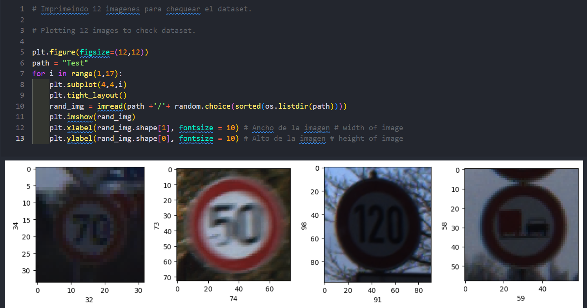
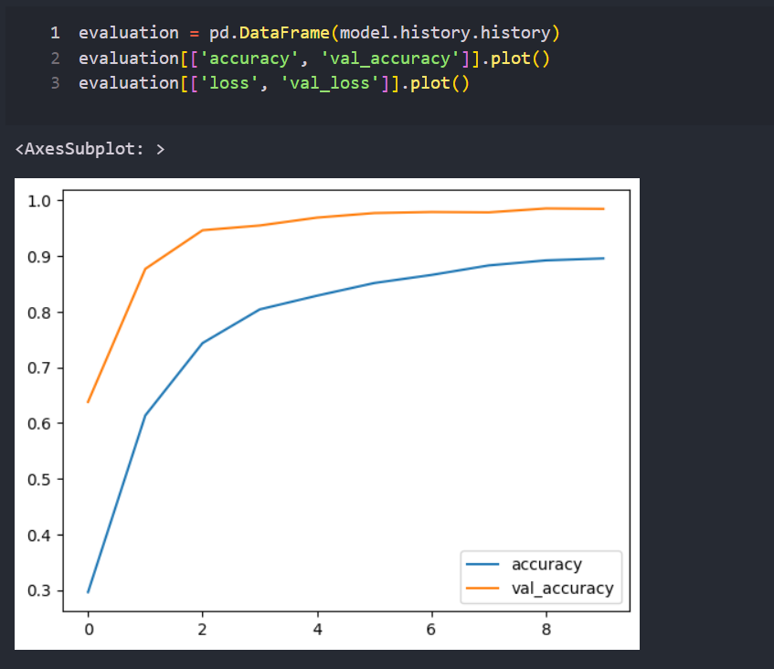

# Senales de trafico

El siguiente proyecto consiste en la deteccion automatica de diferentes imagenes interpretadas como senales de trafico.
Se utilizaran varias herramientas para este caso y se aconseja conocer lo siguiente (o al menos tener un conocimiento minimo):
  
*   Python
*   Tensorflow
*   Keras

En este proyecto, vamos a usar redes neuronales convolucionales para construir, entrenar y testear un modelo de clasificacion de carteles de trafico. Vamos a construir este modelo usando Tensorflow y Keras. este es un problema de clasificacion multiclase. Este modelo puede ser usado en vehiculos autonomos para reconocer los diferentes signos de trafico.

In this project, we will use Convolutional Neural Network to build train and test a traffic sign classification model. We will build this model using Tensorflow and Keras. It is a multiclass classification problem. This model can be used in autonomus cars to recognize difertens traffic signs.

## Algunas capturas de imagenes del proyecto:

